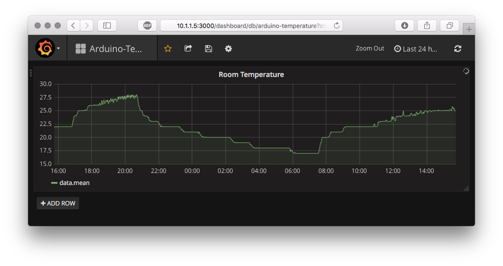

# A fullstack Arduino temperature monitor 

# Up and Running

## Arduino

### Configure the firmware

### Arduino components & wiring

## Backend

### Docker setup

### Influxdb configuration

### Grafana configuration

